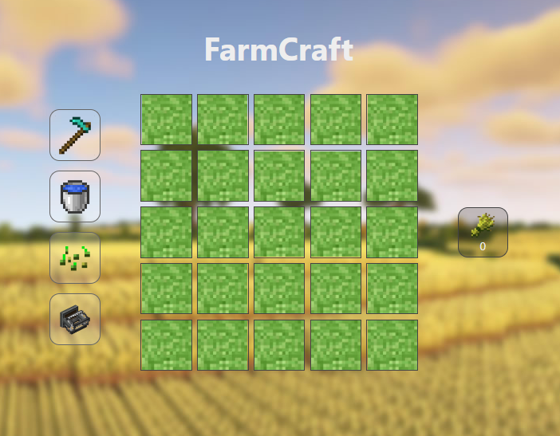
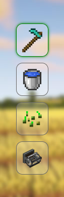
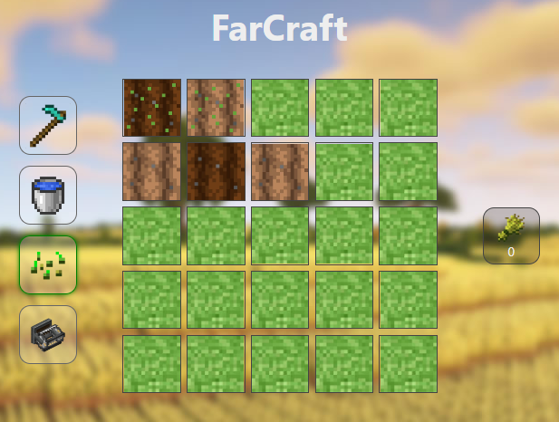
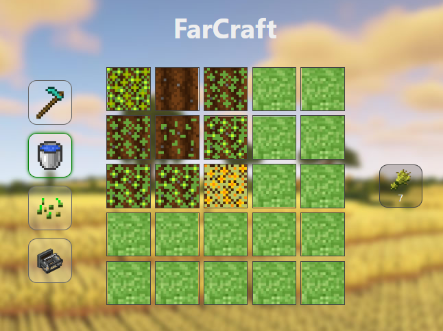
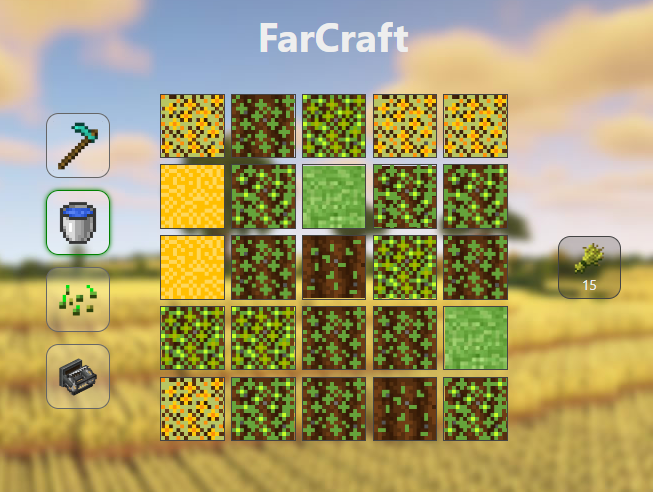

# COMPTE RENDU TP FARMCRAFT

## OBJECTIFS
Réaliser un petit jeu dans lequel vous cultiverez des champs de blé.
Vous utiliserez JavaScript pour manipuler le DOM et déclencher des événements à intervalles réguliers.

## CREATION DES CHAMPS
On créer la fonction generateFields:
```javascript
function generateFields(){
    const field = document.querySelector("field-parts");
    for (let i = 0; i < 25; i++){
        const fieldpart = document.createElement("field-part");
        fieldpart.classList.add("grass");
        field.insertAdjacentElement("beforeend", fieldpart);
    }
}
```
On appele la fonction « generateFields » lorsque la page a terminé son chargement:
```javascript
window.addEventListener("load", fonction_a_appeler_au_chargement);
```
On obtient alors :

## SELECTION DES OUTILS

On créer la fonction attachToolsEvent:
```javascript
function attachToolsEvent(event){
    const thistool = event.target;
    let tools = document.querySelector("tools");
    for (const tool of tools.children){
        if(tool.classList.contains("active")){
            tool.classList.remove("active");
        }
    }
    thistool.classList.add("active");
}
```
On ajoute un écouteur d'événements à chaque outil:
```javascript
function connectClickEvent() {
    const tool = document.querySelectorAll("tool");
    for(let i = 0; i < tool.length; i++){
        tool[i].addEventListener("click", attachToolsEvent);
    }
}
```
On appelle la fonction « connectClickEvent » lorsque la page a terminé son chargement:
```javascript
window.addEventListener("load", connectClickEvent);
``` 
On obtient alors :




## ACTION DES OUTILS SUR LE CHAMPS
On créer la fonction changeField qui gangera les actions des outils sur le champs:
```javascript
function ChangeField(event){
    const field = event.target;
    let state = "";
    let tools = document.querySelector("tools");
    for (let tool of tools.children){
        if(tool.classList.contains("active")){
            state = tool.id;
        }
        switch (state){
            case "tool-hoe": field.classList.add("farmland"), field.classList.remove("grass");break;
            case "tool-water": if(field.className == "farmland"){field.classList.add("hydrated"); field.dataset.hydrotime = 0;};break;
            case "tool-sow": if(field.classList[0] == "farmland" && (field.dataset.seed == 0 || field.dataset.seed == null)){field.dataset.seed = 1};break;
            case "tool-harvest": if(field.dataset.seed == 7){document.querySelector("#stock-wheat").innerHTML ++}; field.dataset.seed = 0; break;
        }
    }
}
```
On met aussi a jour la fonction connectClickEvent pour ajouter un écouteur d'événements à chaque champ:
```javascript
function connectClickEvent() {
    const tool = document.querySelectorAll("tool");
    for(let i = 0; i < tool.length; i++){
        tool[i].addEventListener("click", attachToolsEvent);
    }
    const fields = document.querySelectorAll("field-part");
    for(let i = 0; i < fields.length; i++){
        fields[i].addEventListener("click", ChangeField);
    }
}
```
Chaque outil est donc fonctionnel : 


## POUSSE DU BLE
On créer la fonction grow qui gérera la pousse du blé toute les secondes:
```javascript
function grow(){
    const fields = document.querySelectorAll("field-part")
    for(const field of fields){
        if(field.dataset.seed > 0 && field.dataset.seed < 7){
            field.dataset.seed ++;
        }
    }
    window.setTimeout(grow,1000); // récursivité de la fonction grow à chaque seconde
}
```
On lancera la fonction grow lorsque la page a terminé son chargement:
```javascript
window.addEventListener("load", grow);
```
Le blé pousse donc toutes les secondes:

On observe aussi que l'outils de récolte fonctionne correctement.
## PROBABILITES
Enfin on integre au jeu les 3 regels suivantes:

- Chaque seconde, le blé à 30% de chance de passer au stade si le champ est arrosé. Sinon,
cette probabilité chute à 5%.

- Un champ arrosé reste humide pendant 10 secondes puis redevient sec.

- Un champ sec sans graine (data-seed = 0) à 1% de chance de redevenir de l’herbe à chaque
seconde.

Pour cela on met a jour la fonction grow, pour n'avoir qu'une seule fois l'appel de la fonction SetTimeout:
```javascript
function grow(){
    const fields = document.querySelectorAll("field-part")
    for(const field of fields){
        let proba = Math.floor(Math.random()*100);
        if(field.classList[1] == "hydrated" && field.dataset.hydrotime < 10) {
            field.dataset.hydrotime ++;
        }
        if((field.dataset.seed == 0 || field.dataset.seed == null) && field.className == "farmland" && proba == 1){
            field.classList.remove("farmland")
            field.classList.add("grass")
        }
        if(field.dataset.hydrotime == 10 && (field.dataset.seed == 0 || field.dataset.seed == null))
        {
            field.classList.remove("hydrated");
        }

        if(field.dataset.seed > 0 && field.dataset.seed < 7){
            if(field.classList[1] == "hydrated" && proba <= 30){
                field.dataset.seed ++;
            }
            else if(field.className == "farmland" && proba <= 5){
                field.dataset.seed ++;
            }
        }
    }
    window.setTimeout(grow,1000); // un seul setTimeout pour garantir que ce soit à chaque second
}
```
On obtient alors le jeu final:


## CONCLUSION

Ce TP nous a permis de manipuler le DOM en JavaScript et de créer un petit jeu de culture de blé. Nous avons pu mettre en place des function qui interagissent directement avec la page web. La dernière partie du TD avec la mise en place des 3 règles était la plus complexe mais elle a permis de mettre en place des probabilités et des conditions pour la pousse du blé ainsi que la manipulation du temps.
Ce TP nous a permis de mettre en pratique les notions vues en cours et de nous familiariser avec la manipulation du DOM en JavaScript.
